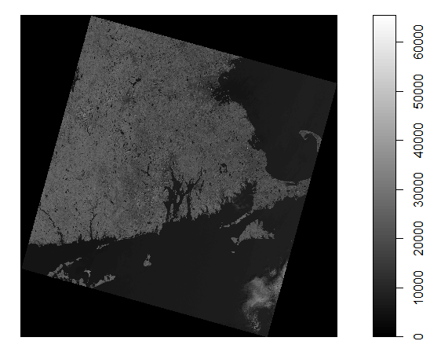
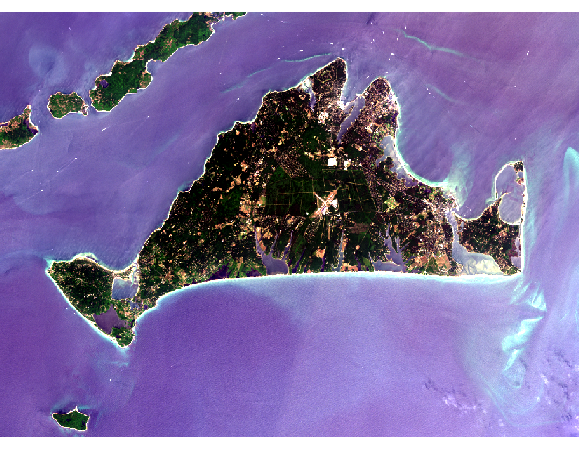
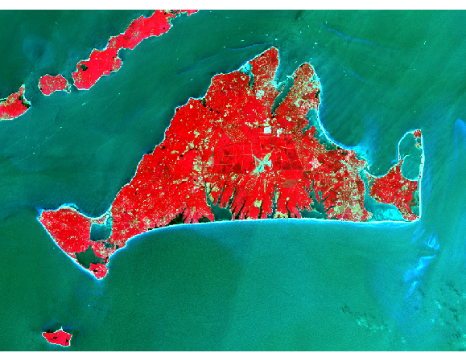
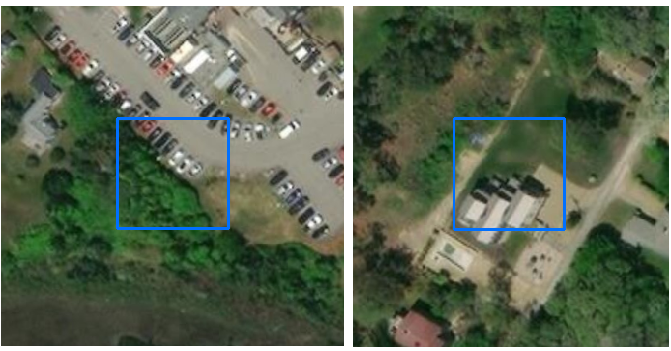
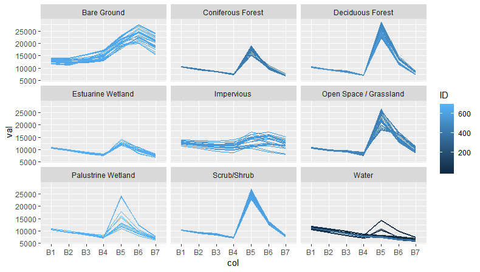

```{r setup, include=FALSE}
knitr::opts_chunk$set(echo = TRUE)
```

Landcover mapping based on aerial photographs and ground truth survey is a time consuming process with inherent problems. Human interpretation takes many hours and is subject to human perception.  Satellite imagery and machine learning algorithms, have been used to create landcover maps for use on a wide variety of environmental projects.  Landsat Thematic Mapper imagery can be used to classify landcover but is limited due to spatial resolution of 30 meters (ground pixel).  

This project will use the Random Forest Classifier and a Landsat 8 TM image of Southeastern Massachusetts to attempt to predict 9 landcover classes based on spectral response across 7 bands, in selected landcover training pixels.  The final model will be used to classify the entire test image and an accuracy assessment will be performed using landcover ground truth data interpreted from aerial photographs. 

## Dataset Summary

Since 1972, the NASA Landsat program has imaged the earth at varying spectral, and spatial resolutions using a series of satellites. LandSat 8 was launched in 2013 and includes 7 bands of spectral information in the visible and infrared spectrum.  The imaging scanner collects pixels of reflected light at a fairly course spatial resolution (30 meters ground sampling unit) but this allows large swaths of the earth to be recorded on a regular basis and provides ready to analyze images for use in many applications.  For this project, I have acquired a single path/row in the form of individual tiff images for each reflectance band the satellite covers.  The band/wavelength breakdown are as follows.


The Landsat Thematic Mapper 8 satellite also records additional bands that I will not use in this project. Bands 8, 9, 10, 11 are of varying spatial and spectral resolutions but are typically used for additional detail, cloud identification, and Thermal information. A single Landsat 8 image of Path 012 Row 031 acquired on July 13, 2016 was chosen for the project.  A 2016 image was chosen because a comprehensive landcover map from 2016 was available to use as ground truth for the project.  A July image was chosen to insure that a significant amount of vegetation would be visible by the sensor, in hopes that it might allow for better separation of image landcover classes. The image was downloaded from the [USGS](https://earthexplorer.usgs.gov/) website  


Each band used in this project was processed into a single panchromatic image where the lowest response pixels are black or near black and the highest response are white or near white. In addition to reflectance values the images are georeferenced meaning that the pixels are tied to latitude and longitude locations on the ground. The individual pixels values for each band are stored and so are coordinates for the center of the pixel. This allows users to drape the tif images over a map with the necessary software packages. The data is delivered in separate geotiff files for each band and was imported into a spatial dataframe in r with the following code:

```{r import, eval=FALSE}
library(rgdal)
library(raster)

path <- "C:/JP/USGS/LC08_07132016"
setwd(path)

new_B1 <- readGDAL("LC08_L1TP_012031_20160713_20180130_01_T1_B1.tif")
new_B2 <- readGDAL("LC08_L1TP_012031_20160713_20180130_01_T1_B2.tif")
new_B3 <- readGDAL("LC08_L1TP_012031_20160713_20180130_01_T1_B3.tif")
new_B4 <- readGDAL("LC08_L1TP_012031_20160713_20180130_01_T1_B4.tif")
new_B5 <- readGDAL("LC08_L1TP_012031_20160713_20180130_01_T1_B5.tif")
new_B6 <- readGDAL("LC08_L1TP_012031_20160713_20180130_01_T1_B6.tif")
new_B7 <- readGDAL("LC08_L1TP_012031_20160713_20180130_01_T1_B7.tif")
```

The import makes use of several R libraries specifically the rgdal and raster packages.  These must be loaded in order to import the individual tif files. After the upload is complete, each band is stored in a spatial grid data frame.

The code below displays a single band (spatial grid dataframe) using the plot command.

``` {r band5, eval=FALSE}
plot(new_B5,col = gray(0:100 / 100))
```


Once each tif file is imported into a spatial grid dataframe each individual dataframe is converted into a raster layer and then stacked into a single dataframe with 7 dimensions using the code below.

```{r stack, eval=FALSE} 
# Create a raster stack image of all 7 bands of the subsetted image
FullImage <- stack(raster(new_B1), raster(new_B2), raster(new_B3)
                   , raster(new_B4), raster(new_B5), raster(new_B6), 
                   raster(new_B7))

# update the names of the raster stack to a simpler B1 - B7
names(FullImage) <- paste0("B", c(1:7))
```

The result is a very large raster stack with dimensions of 8011 rows and 7901 columns. The image (spatial data frame) has a total of 63,294,911 pixels (rows) and 7 layers (one for each band B1 - B7).  I created a more manageable study area to reduce processing time for this project. The full image was subset using a polygon feature class. This feature class was imported from an ESRI file geodatabase and used to crop the image to create a more manageable study area for the project.  The image now centers on the island of Martha's Vineyard and can be seen in Figures 3 and 4. 

The following code was used to import the feature class (used to crop the full image) into a spatial polygons dataframe.  The code then subsets the image into the final study area.

```{r subset, eval=FALSE}
# load file geodatabase path to use as a connection (dsn) in the next step
fgdb <- "C:\\JP\\DataScienceClasses\\Capstone\\LandCover\\lclu_gdb\\MA_LCLU2016.gdb"

# import the feature class MVSubsetBND for subsetting the image
MVSubsetBND <- readOGR(dsn=fgdb, layer="MV_Subset")

# Subset the raster stack (full Image) using the imported study area boundary (MVSubsetBND)
MVSubsetImg <- crop(FullImage, MVSubsetBND)
```

Now that the final study area has been created we can start our analysis.

Visual image interpretation of the imagery can be done using the computer screen. A single panchromatic band (layer) is mapped to the blue, red, or green display of the computer screen and in combination with other bands results in a raster stack that can be intepreted. A true color image can be displayed by matching band 4 to red, band 3 to green and band 2 to blue. (4,3,2).  



While the near infrared and short wave infrared bands are not in the range of light the eye can see, we can create a pseudo color image using the screen colors and map the NIR and SWIR bands to the visible red, green, or blue display of the computer screen and visually interpret the image.




For this project we will create a model to predict landcover based on the 7 bands of pixel reflectance in the Study Area Image.  We will train the model by selecting pixels of known landcover (based on ground truth information) and extracting their values from the Study area image across all 7 bands.  The resulting dataframe of extracted training pixels will be used to train the model in hopes of predicting landcover for pixels not in the training area.

## Model Creation and Training Methodology

This project attempted to model landcover based on pixel reflectance values in a satellite image subset.  The landcover types included in the project were the following: 

Impervious Surfaces  
Developed Open areas / Grassland  
Deciduous Forest  
Coniferous Forest  
Scrub/Shrub  
Palustrine Wetland (Non salt water wetland)  
Estuarine Wetland (salt water wetland)  
Bare Ground (Sand, Exposed Dirt)  
Water  

The first step in creating the model was to collect pixel reflectance values for areas of known landcover. Since the imagery is georeferenced to locations on the ground we can use other georeferenced imagery (in this case aerial photographs and GIS layers) to identify suitable training areas of the known landcover classes in this project. Training polygons for the study were acquired for each landcover type using aerial photo interpretation.  The polygons were stored in a ESRI feature class and later used to extract pixels from the study area image.  

A few of of the training polygons are shown in Figures 4, 5, and 6, below:  


Training polygons were identified over areas of pure landcover and the polygons were used to extract reflectance information over the much coarser resolution (30 meter pixel) Satellite image used in the project.

The final set of training polygons was imported into R with the following code:

```{r trainingSets, eval=FALSE}
TrainingPixels <- readOGR(dsn=fgdb, "MVTrainingAreas")
class(TrainingPixels)
```

The result is a spatial Polygons dataframe that identifies areas on the ground that correspond to the 9 landcover types we are attempting to identify.   
This set of polygons was used to pull reflectance values from the satellite image across all 7 bands.  The 7 bands of reflectance values were pulled from pixels that fell inside the training areas. These values were input into a dataframe. 

The following code creates a dataframe that holds the pixel values and a class number for each of the above landcover types  
 
``` {r pixelExtract, eval=FALSE}
responseCol <- "CovCode"

dfTraining = data.frame(matrix(vector(), nrow = 0, ncol = length(names(MVSubsetImg)) + 1))   
for (i in 1:length(unique(TrainingPixels[[responseCol]]))){
  category <- unique(TrainingPixels[[responseCol]])[i]
  categorymap <- TrainingPixels[TrainingPixels[[responseCol]] == category,]
  dataSet <- extract(MVSubsetImg, categorymap)
  dataSet <- dataSet[!unlist(lapply(dataSet, is.null))]
  dataSet <- lapply(dataSet, function(x){cbind(x, class = as.numeric(rep(category, nrow(x))))})
    df <- do.call("rbind", dataSet)
    dfTraining <- rbind(dfTraining, df)
}
head(dfTraining)
```

dfTraining is a dataframe of 679 pixels across the various landcover types.  Each row of the dataframe includes reflectance values for a single image pixel across each of  the 7 bands as well as a class column to identify which landcover type it belongs to.  

Training data is an important part of any machine learning project.  Satisfied with the pixel training sets the next step was to use dfTraining to train the model.

## Random Forest

Random Forest is one of the most widely used ensemble classification algorithms.  It uses a series of decision trees to make predictions.  Separate decision trees each based on subsets of predictors and training pixels attempt to predict the landcover class for each training pixel.  The class assigned is based on majority vote of all the trees involved. For this project I used the Random Forest algorithm for prediction. The results in the training stage showed a good fit between training pixels and the model results.   The accuracy assesment portion of this document will outline how close the model was in predicting the landcover in the pixels outside the training area. 

dfTraining (our training data set) is only a tiny subset (680 pixels) of the entire study area image (723 x 1131 or 817,713 pixels). I considered the entire image as the test set and after model training used the final model to classify the test set.  An accuracy assessment is in the final section of this report.

Using the dfTraining dataframe created in the earlier section of this report, I used the following code to create the model. In order to use the random forest algorithm I loaded the caret package in R

```{r modelcreation, eval=FALSE}
# apply randomforest to training set.  Using all 7 bands  
library(caret)
rfmod1_7 <- train(as.factor(class)~ B1 + B2 + B3 + B4 + B5 + B6 + B7, method = "rf", data = dfTraining)
rfmod1_7
```
 
The 9 classes were stored as numbers:

2 - Impervious 
5 - Developed / Grassland  
9 - Deciduous Forest  
10 - Conferous Forest  
12 - Scrub/Shrub  
15 - Palustrine Wetland  
18 - Estuarine Wetland  
20 - Bare Ground  
21 - Water  

The results of running the model were the following:

*Random Forest*  

*679 samples*   
  *7 predictor*  
  *9 classes: '2', '5', '9', '10', '12', '15', '18', '20', '21' *  

*No pre-processing*  
*Resampling: Bootstrapped (25 reps)*   
*Summary of sample sizes: 679, 679, 679, 679, 679, 679, ...*   
*Resampling results across tuning parameters:*  

  *mtry  Accuracy   Kappa*      
  *2     0.9714590  0.9544240*  
  *4     0.9706776  0.9532316*  
  *7     0.9645432  0.9436245*  

*Accuracy was used to select the optimal model using the largest value.*  
*The final value used for the model was mtry = 2.*  

The model created decision trees based on subsets of the  7 bands of info (7 predictors) and 679 training pixels (samples) to predict 9 classes.  The training pixels generated an accuracy of .9715 and a Kappa of .9544

Once satisfactory accuracies were achieved the next step was to use the model to classify landcover across all 800,000+ pixels in the test image (study area image). That was done with the following code.

```{r classify, eval=FALSE}
LC_Pred_MV <- predict(MVSubsetImg, model = rfmod1_7)
```
The results was a raster (LC_Pred_MV) layer with pixel values equal to the landcover class values in the dataframe.  

## Results - Accuracy Assessment

The model is based only on the training pixels and while it does a pretty good job binning the known landcover pixels in the training set the real test of the model is making predictions on the test set.  In this case the test set is the test image (all pixels in our image that are not in the training polygons).  LC_Pred_MC is a 723 x 1131 raster layer that has a single value, landcover class.  It is difficult to determine the accuracy of the final image because there aren't many available sources of groundtruth.  Random pixels are chosen and landcover is determined by either visiting the locations on the ground, intepreting aerial photography acquired during the same time frame as the image (if it exists and is available), or by using other data sources.  In this case, a newly acquired landcover layer from the state of Massachusetts was available.  These landcover polygons were interpreted from 2016 aerial imagery and digitized.  I subset a piece of this data that covered the study area of this project.  I converted the vector polygons to a raster image at 30 meter resolution to match the Landsat image.  Once I had the image in this format I imported into R with this code and converted it to a vector for easy comparison with the predictions.:

```{r groundtruth, eval=FALSE}
# import the ground truth image for actual interpreted landcover in the test area
GroundTruthImg <- readGDAL("C:\\JP\\DataScienceClasses\\Capstone\\Rec_GrndTruth_fin.img")
#convert the image to a vector for use in a confusion matrix
GroundTruth <- as.vector(GroundTruthImg$band1)
```
The same was done with the final model predictions.

```{r predictions, eval=FALSE}
#Convert classified image to a vector for comparison
predictions <- as.integer(as.vector(LC_Preds_MV$layer))
```

Once these two sets were converted to vectors a confusion matrix was generated with the following code:

```{r conmatrix, eval=FALSE}
confusionMatrix(table(GroundTruth,predictions))
```

A reformatted and selected set of confusion matrix results are shown below:


While the model predictions based on the training pixels performed well (accuracy of 97%), the overall accuracy of the test pixels came in at 85%. Individual class accuracies in some cases were poor (as low as 6% for Palustrine Wetland). The 85% overall was certainly helped with a very accurate prediction of the water class and the fact that water was a large portion of the pixels in the image.

The next section will outline conclusions and potential ways the algorithm could be improved as well as some of the reasons it may have not performed as well as I hoped it would.

##Conclusions

Landcover classification using Landsat imagery while has potential is limited due to the following factors.  

1) Coarse spatial resolution causes many "mixed pixels" that don't spectrally fall into pure landcover categories and in some cases look similar to some of these categories and a mistakenly classified into these categories.

2) Lack of spectral resolution (only 7 bands) limits the ability to differentiate landcover classes from each other.

3) Poor or unbalanced training set selection.

Figure 8 shows aerial photography of a portion of the study area and Figure 9 shows the LandSat image of the same area.  The coarse resolution is evident. A lack of spatial resolutions leads to mixed pixels. 


Figure 9 shows the aerial imagery with a 30 meter gridcell overlay.  As you can see the photo shows considerable landcover mixing within the grid cells.  These mixed landcover pixels don't conform well to the training classes and are difficult to predict.  Mixes of bare ground, Impervious (roof tops), and Tree canopy can be found in a single pixel reflectance value in the Landsat image. All these features contribute to the reflectance values in all 7 bands but are distilled down to one pixel.



Choosing imagery of higher resolution could solve this issue but no matter what resolution is chosen the problem would persist.  It also would greatly influence processing time and data storage for the project.  

### Spectral Resolution and Training Pixel Selection  

With the 7 bands of reflectance that Landsat collects some mixed or pure pixels will have similar signatures than other non related landcover classes.  Looking at the confusion matrix we see that the Bare Ground class and the Impervious class were often confused.  The impervious landcover is typically concrete and rooftops.  Concrete and sand have very similar spectral signatures across the 7 bands.  

It's also useful to see how grouped the chosen training pixels appear on a plot.  The following code was used to plot a line for each pixel in the training set and group them by landcover class on separate graphs.  The shapes and levels of several of these classes look similar which would lead to confusion when attempting to predict landcover classes.  

```{r trainingplot, eval=FALSE}
library(ggplot2)
library(dplyr)

# add an ID to each pixel in the training 
# dataframe for plotting

ID = seq(1:nrow(dfTraining))
dfTraining <- cbind(dfTraining, ID)

# load simple lookup table created in excel for the landcover classes and merge
#df training to show the class names in the final plot
lookup <- read.csv(file="C:\\JP\\DataScienceClasses\\Capstone\\MyProject\\images\\lookup.csv", header=TRUE)
TrainingSignatures <- merge(dfTraining, lookup, by.x = "class", by.y="LCID")

# load tidyverse to use the gather command
library(tidyr)

test %>% 
  gather(col, val, -c(classname, ID, class)) %>%  # from `tidyr`
  ggplot(aes(col, val, color = ID, group = ID)) + 
  geom_line() +
  facet_wrap(~classname)
```



This plot show the spectral response across the 7 bands for every set of training pixels.  Many of the class plots have similar shapes and this could also lead to prediction confusion.  

In this project the random forest classifier was used to predict 9 classes of landcover in a LandSat 8 satellite image.  The results were mixed and some model tweaking and a more balanced training set selection would be warranted in an attempt to make better predictions.  Model training in this case showed high accuracy but when the model was applied to the test set the results were considerably less accurate. 


